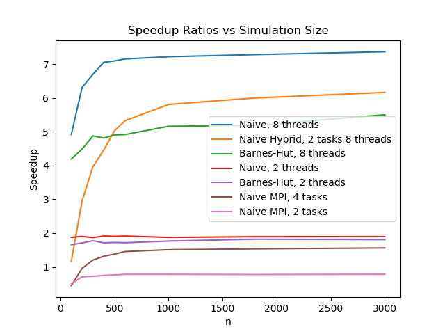
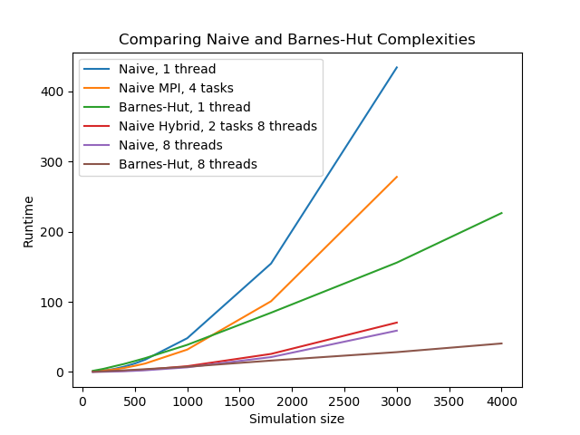

# Swarming and Synchronization with Big Compute Swarmalator Simulations

<table>
<tr>
<td></td>
<td></td>
</tr>
</table>

### Background
The swarm behavior is the collective motion of a large number of self-propelled entities. Many swarming systems in Nature show the remarkable ability to spontaneously fall into synchrony, giving rise to a large number of bio-inspired models. Many researchers have studied the close relation between swarming and synchronization, which interestingly represent two effects that stand as "spatiotemporal opposites". Among them, O'Keefe et al proposed a ‘bottom-up’ models without reference to a background medium, which they called the ‘swarmalators’, to capture their twin identities as swarming oscillators. In the swarmalator model, the paradigmatic model of biological aggregation and synchronization have the following forms:

We see in the position updates a positive attraction term followed by a negative repulsion term, typical of most swarming systems. The phase updates feature a variation of the canonical Kuramoto model for coupled oscillators that may synchronize or desynchronize based on the value of *K*. Thus, the terms *K* and *J* capture the tendency to synchronize/desynchronize and the spatial attraction/repulsion between entites of similar phases respectively. A combination of different *K* and *J* values yield a series of different swarmalator states shown as follows:

The swarmalator model simulation intuitively falls into the category of a special kind of N-body problem, which is traditionally compute intensive. The dynamic scale that needs to be resolved for studying a real-world swarming system in a self-consistent manner is enormous and spans many orders of magnitudes, thus necessitating the use of high performance computing and carefully tailored codes that can utilize various HPC programming models. A naive application of the O'Keefe model quickly stretches into the realm of hours for swarms in the thousand, so HPC implementations can greatly save on time of calculation.

### Description
Naively, the Swarming-Synching model can be simulated by pairwise calculation of aggregation and synchronization forces of individual points and adding up all such contributions on all the entities in the system. Such an approach has a quadratic time complexity and scales up very quickly. Most of the time, when we deal with realistic problems, the entities in a swarm system can be hundreds of millions. Under these scenarios, the quadratic scaling of the naive algorithm is not feasible and approximate models using tree-based data structures, for example, the Barnes-Hut algorithmm, may be utilized to facilitate the computation. As far as big compute techniques are concerned, there is large potential for these algorithms to benefit from parallelization methods such as OpenMP and MPI and as the two algorithms use different data structure, there are differences in where the parallelization can take place and eventually contribute to an overall speedup. Our project aims at investigating the performance of parallelized implementation of both the naive algorithm and the Barnes-Hut algorithm that address the same swarming-synching model, to look into the potential of parallelization in both models and to compare the consequent speedups.

### Github Repository
https://github.com/myue2020/swarming-synching

### Infrastructure
OpenMP/MPI hybrid model on AWS MPI cluster of 2 t2.2xlarge EC2 instances

t2.2 xlarge Instance Specs:
32GiB Memory, x86_64 architecture, 8 vCPU and 1 thread per core, Intel(R) Xeon(R) CPU E5-2686 v4 @ 2.3GHz

Operating System: Ubuntu Server 16.04 LTS

### Dependencies
*odeint* C++ Library

*odeint* is a modern C++ library for numerically solving ordinary differential equations contained within the commonly used *boost* library. We use built-in integrate functions in *odeint* to handle the fourth-order Runge-Kutta integration of all timesteps, and use *boost*'s MPI library rather than normal MPI functions due to dependency issues. To install all dependencies, follow these instructions:

1. wget https://dl.bintray.com/boostorg/release/1.66.0/source/boost_1_66_0.tar.bz2
2. tar --bzip2 -xf boost_1_66_0.tar.bz2
3. cd boost_1_66_0.tar.bz2; ./bootstrap.sh
4. Add the line “using mpi ;” to project-config.jam
5. While still in boost_1_66_0.tar.bz2, export BOOST_MPI=~/SOMEPATH/build-boost; ./b2 -j24 install —prefix=$BOOST_MPI
6. export LD_LIBRARY_PATH=~/SOMEPATH/build-boost/lib

### Code Layout and How to Run

Each working solver (naive_solver.cc, naive_mpi_solver.cc, and barnes_hut_solver.cc) features its own main function that will run a default simulation with *J* = 1, *K* = -0.1, and *ωi* = 0.1, where a specified number of threads will run a specified number of points (the first and second arguments, respectively) instantiated with random phases and positions within the unit circle on a fourth-order Runge-Kutta integration for 50 seconds with a timestep of 0.1 s. All update algorithms are contained in the operator() function of the swarm struct, which is called at each timestep of the *odeint* integrator. See the following screenshot for reference:

quadtree.cc provides the code for the quadtree structure as used for the Barnes-Hut solvers, while figure.py visualizes the csv files produced by any of the solvers in a manner similar to the original O'Keefe paper. All sub-directories (Images, plots, barnes_hut_theta_threshold) contain figures shown here or on the summary presentation presentation.pdf. 

Compilation can be complicated, requiring successful linking to the *boost* library. The following are possible commands to compile and run the various solvers.

g++ -fopenmp -Iboost_1_66_0 naive_solver.cc -o naive_solver; ./naive_solver NTHREADS NPOINTS

g++ -fopenmp -Iboost_1_66_0 barnes_hut_solver.cc -o bh_solver; ./bh_solver NTHREADS NPOINTS

mpic++ -Iboost_1_66_0 naive_mpi_solver.cc -Lbuild-boost/lib -lboost_mpi -lboost_serialization -std=c++11 -fopenmp -Ofast -o naive_mpi; mpirun -np NPROC ./naive_mpi NTHREADSPERPROC NPOINTS

### Implementation

All code is tested for correctness via visual comparison of final figures produced by figure.py to the five standard states of the O'Keefe model shown above, which for this rather sensitive model shows dramatic differences in the case of parallelization errors. Indeed, (d) was not able to be replicated due simply to our low-order integrator (a more complicated higher-order and adaptive integration scheme is likely needed to pick up the discreteness of the rainbow). These states thus served as our primary test cases.

#### Naive Algorithm

For the naive algorithm, we simply perform the *O(n^2)* update via nested for-loops, though in naive_solver.cc we do attempt to increase efficiency slightly by only iterating through each pair once. This could not be transferred to the MPI solution since each processor cannot easily update another processor's data, thus requiring the use of a slightly different algorithm in naive_mpi_solver.cc. For each update, we first have each processor share their position and phase data with every other processor, before continuing with the update with normal OpenMP loops. This solver is constrained such that number of MPI tasks called for must evenly divide the number of points, for ease of the algorithm.

#### Barnes-Hut Algorithm
The Barnes-Hut algorithm is often used in simulating N-body systems. It is based on the assumption that the force from many far-away bodies can be approximated with a single object located at the center of mass and carries the total mass of those bodies.

<table>
<tr>
<td></td>
<td></td>
</tr>
</table>

- Quadtree

In a quadtree, each internal node has 4 children. As shown in the first figure, when inserting particles into the tree, quadrants are recursively subdivided into 4 nodes at each level, until each leaf in the tree contains at most one particle.

- Computing Time Derivatives  

To calculate the overall time derivatives of spatial position and phase of particle $b$, use the following recursive procedure, starting with the root of the quad-tree:

1. If the current node is an external node (and it is not particle *b*), calculate the influence from the current node on *b*, and add this amount to *b*'s net force.

2. Otherwise, calculate the ratio *s/d*. If *s/d<\theta*, treat this internal node as a single body, and calculate its influence on particle *b*, and add this amount to *b*'s net force.

3. Otherwise, run the procedure recursively on each of the current node's children.

In the above computation, we use the same time derivative formulae as in the naive algorithm. Overall, the Barnes-Hut algorithm has a time complexity of *O(n log n)* as both the build tree and traversal process (*n* particles, *n* traversals) has a time complexity of *O(n log n)*.

- Integration  

After the time derivatives are calculated, we use the built-in function in *odeint* to handle integration, thus update the positions and phases of the particles in the swarming-synchronizing system.

- Parallelization Scheme

Our initial scheme includes broadcasting the tree data structure with MPI to parallelize the for-loop for computing the time derivatives and using OpenMP for parallelizing updating the particles, which does not need all the data in the tree. After some attempts at implementation, we realized that broadcasting a quadtree, which is a customized data structure, requires serialization of the data structure first before sending to MPI to handle its broadcast to worker nodes. This is on the one hand, very hard to implement and on the other hand, not particularly advantageous compared to just use a shared memory parallelization, so we replaced this part with OpenMP parallelization. However, we implemented a version that use MPI to broadcast the particles before building the Quadtree, which is similar to using OpenMP in functionality. To summarize, we did not eventually use MPI in a way that particularly distinguishes its benefit from a shared memory parallelization in that the intra-node communication feature did not see a good spot to step in.

#### Naive Algorithm Example
1. Initial State

  \
Randomized initial states

2. Final State

\
Final stable solution of a continuous rainbow using the naive algorithm. We can observe similar correspondence to the original five standard states of the O'Keefe paper shown above, with the exception of (d) due to our relatively low-order integrator.

#### Barnes-Hut Algorithm Example
1. Initial State

\
Randomized initial states

2. Final State

\
Final stable solution of a continuous rainbow using the Barnes-Hut algorithm. We can observe similar correspondence to the original five standard states of the O'Keefe paper shown above, with the exception of (d) due to our relatively low-order integrator.

#### Attempts at Optimization

We experimented with different compiler flags to lower runtime, finding that -Ofast did not negatively affect the accuracy or speedup of parallelized algorithms in any case. The below tests were conducted for the case of 500 simulation objects.

|                       | -O0       | -O1       | -O2       | -O3       | -Ofast    |
|-----------------------|-----------|-----------|-----------|-----------|-----------|
| naive, 1 thread       | 25.323304 | 13.306423 | 12.608864 | 12.749575 | 12.008113 |
| naive, 8 threads      | 4.029078  | 1.864422  | 1.780282  | 1.782941  | 1.705384  |
| naive, 4 nodes        | 13.92434  | 8.369722  | 8.126015  | 7.982621  | 7.763066  |
| Barnes-Hut, 1 thread  | 159.39276 | 17.363245 | 17.149313 | 16.11532  | 15.458164 |
| Barnes-Hut, 8 threads | 24.266724 | 3.412126  | 3.36841   | 3.204692  | 3.192476  |

We also experimented with different OpenMP schedules, finding that a dynamic schedule in the update greatly reduced runtime as compared to default static schedules.

### Discussion and Analysis

#### Speedup Analysis

<table>
<tr>
  <td>   </td>
  <td>   </td>
</tr>
</table>

On the left plot, we show the trends of weak scaling for this problem, both for the naive implementations and for the Barnes-Hut framework. On the right plot, we see the strong scaling, at least in terms of speedup, of our implementations as we dial up the simulation size.

Overall, from the right graph we see that all implementations quickly reach an asymptotic speedup at around 500 to 1000 simulation objects.

We see that the untouched naive implementation has the most linear speedup response to parallelization. This is as expected, since this pure implementation is based on two straightforward for-loops that iterate throughout the timesteps, allowing most of the program to be parallelizable; in other words, very little of the code remains to run in serial, and little overhead work is done. On the right plot, we see that speedup seem to approach the expected value as we increase the number of simulation objects.

The Barnes-Hut implementation, on the other hand, has a significant portion of computation spent on constructing and updating the QuadTree structure, and its recursive nature makes parallelizing difficult. This tree code is left to run in serial, and instead only the for-loop to the update of positions and phases is run in parallel. Hence, for Barnes-Hut we see a cap in the trend of its speedup. We see a slower-than-linear trend in the left graph, and on the right graph an asymptotic cap of a value around 5 even when run with 8 threads.

Lastly, we run our pairwise naive algorithm, but this time using MPI. Our swarming problem is not well suited for MPI frameworks, so the performance is terrible. MPI works best when each segment of data is mostly independent from other tasks, and only a minimal amount of data needs to be communicated among the tasks. Our swarming problem, however, requires each object to have full knowledge of every other object at each sweep of the timesteps, which in turn requires each "ghost exhange" to exchange the full dataset. This means that each task needs to send its full data to every other task, and from the plots above we see that this causes the Naive MPI model to be extremely inefficient. On the right graph, we see that running MPI with two tasks is in fact strictly worse than running completely serially, as the entire setup of MPI and its overhead becomes unnecessary. Indeed, we see in the following plot that for the hybrid OpenMP/MPI model, increasing number of MPI tasks strictly decreases performance for the same rough amount of parallelization.

  

#### Complexity Analysis

  

Here we show a plot of various runtimes for several trials of our algorithms. Note two comparisons: one between "Naive, 1 thread" and "Barnes-Hut, 1 thread", and the other between "Naive, 8 threads" and "Barnes-Hut, 8 threads". Both of these comparisons show a relationship that we hoped to find, which is an *n^2* scaling for the naive algorithm and an *nlog(n)* scaling for the Barnes-Hut algorithm. 

#### Barnes-Hut accuracy-efficiency tradeoff
There is a *theta* threshold in the Barnes-Hut tree that is used when considering the neighbors of a given point. So far in our simluations, we have set this threshold as 0.5 by default, and have not altered this parameter for consistency throughout our data. Here we briefly mention the effects of changing this parameter and what this entails for the Barnes-Hut approximation.

A *theta* of 0 is equivalent to solving the exact solution iterating through every pairwise interaction. We calculate the ratio of a neighbor point's grid width over the distance to that neighbore from the current point, and if this ratio is less than *theta* then we approximate this neighbor with its grid. As *theta* increases, more and more points get approximated as rough blocks, so we save on computation time as shown in the graph below.

   

This is a tradeoff with accuracy, and at some point our approximation causes the stable solution to be visually incorrect. Here we show a progression of *theta* as 0, 0.5, 1, 1.5, and 2. We see that for ranges of *theta* between 0 and 1, the graph still looks visually close to correct, and higher threshold values eventaully cause the solution to be entirely different.

<table>
<tr>
<td>   </td>
<td>   </td>
<td>   </td>
<td>   </td>
</tr>
</table>

\
This is the tradeoff of using an approximation scheme. One should choose a threshold that satisfies both their accuracy needs and provides a practical computation time, and experimenting for the right balance will allow the efficiency of Barnes-Hut to shine through. 

In the end, we successfully implement parallelized *O(n^2)* and *O(n log n)* models to accurately calculate swarms, and see not only a tradeoff between their efficiency and their accuracy but also between runtime and speedup (Barnes-Hut has lower speedup due to more serial work, but has faster runtime overall). We also designed a successful OpenMP/MPI hybrid model, though due to the naive algorithm adding more MPI tasks proved to be less efficient than adding more OpenMP threads. Major takeaways from this project included these tradeoffs as well as the general experience of using external libraries like *boost* in conjunction with OpenMP and MPI, and the implementation and linking challenges that can result from this. A very exciting direction to take this project would be the successful implementation of a hybrid OpenMP/MPI Barnes-Hut model, which would likely prove more promising than for the naive model since only centroids, rather than the entire stretch of data, would need to be passed between processors. Also, running the models with larger computing resources could provide very fascinating insight into the Barnes-Hut algorithm's potential use in large-scale swarmalator simulations.

#### Challenges

Applying complex parallelization stragies to code heavily featuring external libraries like *odeint*.

Complexity of our Barnes-Hut tree structure did not lend itself to simple MPI communication schemes. However, we have proposed a potential Barnes-Hut MPI solution for the next iteration of design.

- Serialize the Quadtree and send it under a MPI\_Type\_contiguous defined MPI Datatype. Or using Boost.MPI dependencies serialization::access to create a friend class of the Quadtree, functioning in a similar manner to the first approach. 
- We also need to make sure MPI Barriers are placed properly before broadcasting the tree to worker nodes.

<table>
<tr>
<td></td>
<td></td>
</tr>
</table>

### References
1. O’Keeffe and Bettstetter. *A review of swarmalators and their potential in bio-inspired computing}*  https://arxiv.org/pdf/1903.11561.pdf. 2019.
2. O’Keeffe, Hong, and Strogatz. *Oscillators that sync and swarm*,  https://www.nature.com/articles/s41467-017-01190-3. 2017.
3. Gan and Xu. *Efficient Implementation of the Barnes-Hut Octree Algorithm for Monte Carlo Simulations of Charged Systems*  https://arxiv.org/pdf/1305.1825.pdf. 2013.
