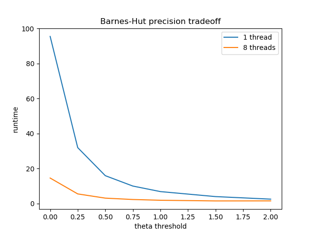

# Swarming and Synchronization with Big Compute O'Keefe Model Implementations

Hybrid implementation of two algorithms based on O'Keefe's Swarmalator model.

- Description of problem and the need for HPC and/or Big Data
- Description of solution and comparison with existing work on the problem
- Description of your model and/or data in detail: where did it come from, how did you acquire it, what does it mean, etc.
- Technical description of the parallel application, programming models, platform and infrastructure
- Links to repository with source code, evaluation data sets and test cases
- Technical description of the software design, code baseline, dependencies, how to use the code, and system and environment needed to reproduce your tests
- Performance evaluation (speed-up, throughput, weak and strong scaling) and discussion about overheads and optimizations done
- Description of advanced features like models/platforms not explained in class, advanced functions of modules, techniques to mitigate overheads, challenging parallelization or implementation aspects...
- Final discussion about goals achieved, improvements suggested, lessons learnt, future work, interesting insights…
- Citations

Your web page should include screenshots of your software that demonstrate how it functions. You should include a link to your source code.

<table>
<tr>
<td></td>
<td></td>
</tr>
</table>

### Background
The swarm behavior is the collective motion of a large number of self-propelled entities. Many swarming systems in Nature show the remarkable ability to spontaneously fall into synchrony, giving rise to a large number of bio-inspired models. Many researchers have studied the close relation between swarming and synchronization, which interestingly represent two effects that stand as "spatiotemporal opposites". Among them, O'Keefe et al proposed a ‘bottom-up’ models without reference to a background medium, which they called the ‘swarmalators’, to capture their twin identities as swarming oscillators. In the swarmalator model, the paradigmatic model of biological aggregation and synchronization have the following forms:

Here, the terms *K* and *J* capture the tendency to synchronize/desynchronzie and the spatial attraction/repulsion between entites of similar phases respectively. A combination of different *K* and *J* values yield a series of different swarmalator states shown as follows:

The swarmalator model simulation intuitively falls into the category of a special kind of N-body problem, which is traditionally compute intensive. The dynamic scale that needs to be resolved for studying a real-world swarming system in a self-consistent manner is enormous and spans many orders of magnitudes, thus necessitating the use of high performance computing and carefully tailored codes that can utilize various HPC programming models.

### Description
Naively, the Swarming-Synching model can be simulated by pairwise calculation of aggregation and synchronization forces of individual points and adding up all such contributions on all the entities in the system. Such an approach has a quadratic time complexity and scales up very quickly. Most of the time, when we deal with realistic problems, the entities in a swarm system can be hundreds of millions. Under these scenarios, the quadratic scaling of the naive algorithm is not feasible and approximate models using tree-based data structures, for example, the Barnes-Hut algorithm is often utilized to facilitate the computation. As far as big compute techniques are concerned, there is large potential for these algorithms to benefit from parallelization methods such as OpenMP and MPI and as the two algorithms use different data structure, there are differences in where the parallelization can take place and eventually contribute to an overall speedup. Our project aims at investigating the performance of parallelized implementation of both the naive algorithm and the Barnes-Hut algorithm that address the same swarming-synching model, to look into the potential of parallelization in both models and to compare the consequent speedups.

### Github Repository
https://github.com/myue2020/swarming-synching

### Infrastructure
OpenMP and MPI hybrid model on AWS MPI cluster of t2.2xlarge EC2 instances --------------------- *add number of nodes*
t2.2 xlarge Instance Specs:

32GiB Memory, 8 vCPU ,Intel Xeon 3.3GHz

Operating System: Ubuntu Server 18.04 LTS

### Dependencies
Odeint C++ Library

Odeint is a modern C++ library for numerically solving Ordinary Differential Equations. We use built-in functions in Odeint to handle the integration of all time steps.

### Implementation
#### Naive Algorithm
1. Pairwise Compuation of Time Derivatives  
2. Integration  

#### Barnes-Hut Algorithm
The Barnes-Hut Algorithm is often used in simulating N-body systems. It is based on the assumption that the force from many far-away bodies can be approximated with a single object located at the center of mass and carries the total mass of those bodies.

<table>
<tr>
<td></td>
<td></td>
</tr>
</table>

- Quadtree

In quadtree, each internal node has 4 children. As shown in the first figure, when inserting particles into the tree, quadrants are recursively subdivided into 4 nodes at each level, until each leaf in the tree contains at most one particle.

- Computing Time Derivatives  

To calculate the overall time derivatives of spatial position and phase of particle $b$, use the following recursive procedure, starting with the root of the quad-tree:

1. If the current node is an external node (and it is not particle *b*), calculate the influence from the current node on *b*, and add this amount to *b*'s net force.

2. Otherwise, calculate the ratio *s/d*. If *s/d<\theta*, treat this internal node as a single body, and calculate its influence on particle *b*, and add this amount to *b*'s net force.

3. Otherwise, run the procedure recursively on each of the current node's children.

In the above computation, we use the same time derivative formulae as in the naive algorithm. Overall, the Barnes-Hut algorithm has a time complexity of *O(n log n)* as both the build tree and traversal process (*n* particles, *n* traversals) has a time complexity of *O(n log n)*.

- Integration  

After the time derivatives are calculated, we use the built-in function in Odeint to handle integration, thus update the positions and phases of the particles in the swarming-synchronizing system.

- Parallelization Scheme

Our initial scheme includes broadcasting the tree data structure with MPI to parallelize the for-loop for computing the time derivatives and using OpenMP for parallelizing updating the particles, which does not need all the data in the tree. After some attempts at implementation, we realized that broadcasting a quadtree, which is a customized data structure, requires serialization of the data structure first before sending to MPI to handle its broadcast to worker nodes. This is on the one hand, very hard to implement and on the other hand, not particularly advantageous compared to just use a shared memory parallelization, so we replaced this part with OpenMP parallelization. However, we implemented a version that use MPI to broadcast the particles before building the Quadtree, which is similar to using OpenMP in functionality. To summarize, we did not eventually use MPI in a way that particularly distinguishes its benefit from a shared memory parallelization in that the intra-node communication feature did not see a good spot to step in.

### Example
#### Plotting Into Graph
#### Naive Algorithm
1. Initial State
2. Final State
This is example using 'xxx' to plot graphs

#### Barnes-Hut Algorithm
1. Initial State
2. Final State

### Runtime Analysis

#### Barnes-Hut accuracy-efficiency tradeoff
There is a *theta* threshold in the Barnes-Hut tree that is used when considering the neighbors of a given point. So far in our simluations, we have set this threshold as 0.5 by default, and have not altered this parameter for consistency throughout our data. Here we briefly mention the effects of changing this parameter and what this entails for the Barnes-Hut approximation.

A *theta* of 0 is equivalent to solving the exact solution using every pair

### References
1. O’Keeffe and Bettstetter. *A review of swarmalators and their potential in bio-inspired computing}*  https://arxiv.org/pdf/1903.11561.pdf. 2019.
2. O’Keeffe, Hong, and Strogatz. *Oscillators that sync and swarm*,  https://www.nature.com/articles/s41467-017-01190-3. 2017.
3. Gan and Xu. *Efficient Implementation of the Barnes-Hut Octree Algorithm for Monte Carlo Simulations of Charged Systems*  https://arxiv.org/pdf/1305.1825.pdf. 2013.
